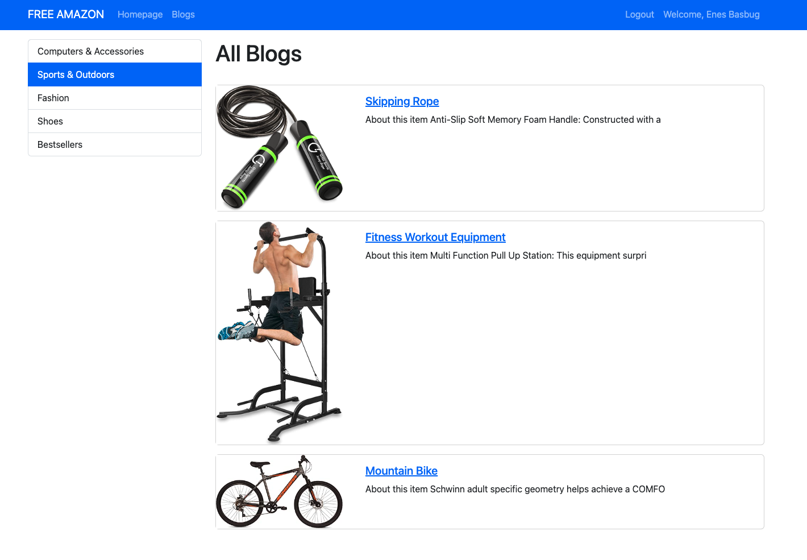
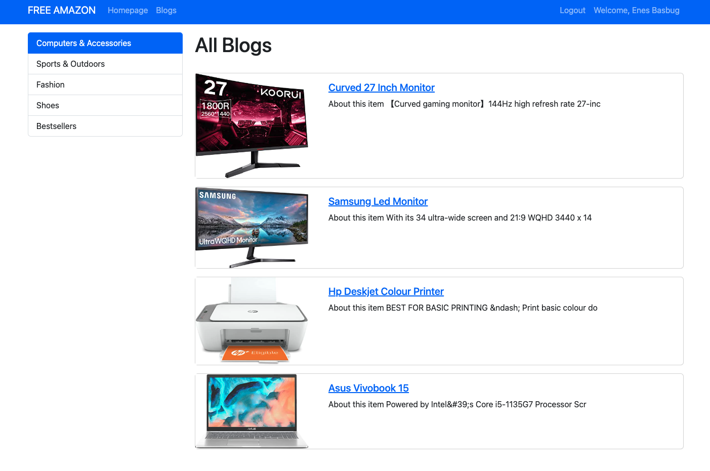
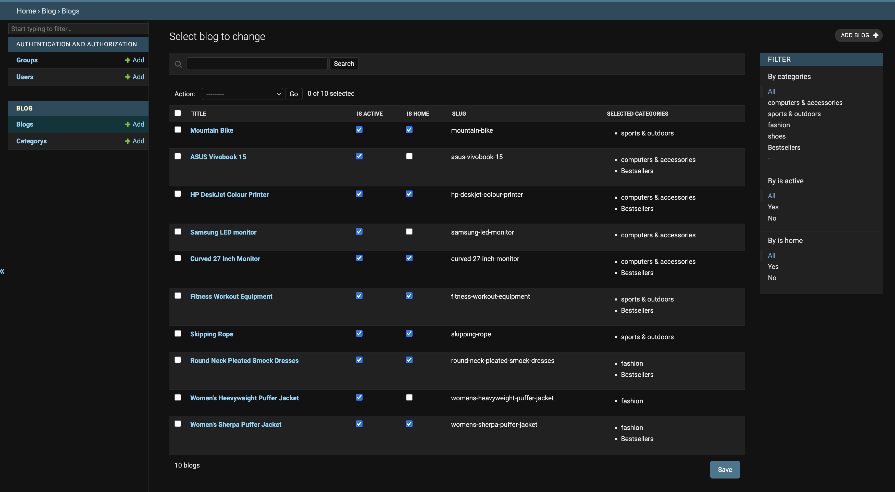

# ecommerce_django

### Live Link : http://djangoawsec-env.eba-ekd3hrdt.us-east-2.elasticbeanstalk.com/

After clone the repo, install the packages required.
<code>$ pip install -r requirements.txt
</code>

You may also access **http://127.0.0.1:8000/admin** page and you can use 

**username**: **Guest_123** 
**password**: **pass_123** 
in order to access admin page and see the admin panel I developed.

